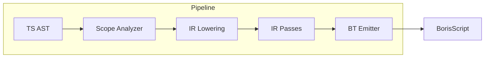

# BT-IR: Полное ревью и план улучшений

## 1. Обзор архитектуры



**Ключевые файлы:**

- [packages/bt-ir/src/ir/nodes.ts](packages/bt-ir/src/ir/nodes.ts) — типы IR
- [packages/bt-ir/src/passes/walker.ts](packages/bt-ir/src/passes/walker.ts) — обход IR
- [packages/bt-ir/src/lowering/visitor.ts](packages/bt-ir/src/lowering/visitor.ts) — TS→IR
- [packages/bt-ir/src/emitter/](packages/bt-ir/src/emitter/) — IR→BS

---

## 2. Типичные проблемы IR-реализаций

### 2.1 Разделение обхода statements и expressions (средняя критичность)

**Проблема:** Walker имеет два независимых API: `mapStatements` и `mapExpression`. Pass, который должен трансформировать и statements, и expressions (например, DCE или constant folding), вынужден вызывать оба и координировать их вручную. `mapStatements` не обходит expressions внутри statements (ReturnStatement.argument, VariableDeclaration.init, ExpressionStatement.expression).

**Где:** [passes/walker.ts](packages/bt-ir/src/passes/walker.ts) — `mapStatementChildren` возвращает `stmt` без изменений для ReturnStatement, VariableDeclaration, ThrowStatement и др.

**Рекомендация:** Добавить `mapIR(program, { statementMapper, expressionMapper })` — единый обход, применяющий оба маппера. Или `mapStatements` с опцией `mapExpressions: true`, которая рекурсивно вызывает `mapExpression` для вложенных выражений.

### 2.2 Отсутствие exhaustiveness checks (низкая критичность)

**Проблема:** При добавлении нового IR node типа легко забыть обновить walker, emitter, или lowering. TypeScript не выдаёт ошибку при `switch` с `default`.

**Где:**

- [passes/walker.ts](packages/bt-ir/src/passes/walker.ts) — `mapExpressionChildren` имеет `default: return expr`
- [emitter/emit-statements.ts](packages/bt-ir/src/emitter/emit-statements.ts) — `default: /* Unknown statement */`
- [emitter/emit-expressions.ts](packages/bt-ir/src/emitter/emit-expressions.ts) — `default: /* unknown expression */`

**Рекомендация:** Использовать `never` для exhaustiveness:

```typescript
default: {
  const _: never = stmt;
  return `/* Unknown: ${(_ as any).kind} */`;
}
```

Или вынести union в отдельный тип и использовать `switch` с `never` в default.

### 2.3 Нет валидации IR инвариантов (средняя критичность)

**Проблема:** IR не проверяется на корректность между lowering и passes. Например: `IRCaseClause` не должен быть top-level; `ForStatement.init` после hoist может быть только `IRExpression` (assignment), не `VariableDeclaration`; `IREnvAssign.envName` должен существовать в scope.

**Рекомендация:** Добавить `validateIR(program): Diagnostic[]` — опциональный pass для dev/debug, проверяющий инварианты. Можно запускать только в тестах или при `--validate-ir`.

### 2.4 Дублирование логики обхода (низкая критичность)

**Проблема:** `mapStatementChildren` и `visitStatementChildren` в walker дублируют структуру IR — при добавлении нового statement с вложенными statements нужно обновить оба места. Аналогично для expressions.

**Рекомендация:** Генерация walker из описания IR (например, аннотации на типах) или единая структура `IR_NODE_CHILDREN` с маппингом kind → поля для обхода.

---

## 3. Стек-специфичные и известные pain points

### 3.1 pendingStatements — мутабельный side-channel (высокая критичность)

**Проблема:** `ctx.pendingStatements` — мутабельный массив, в который `maybeExtract` и другие функции пушат statements. Caller обязан сбросить/вставить их в правильное место. Легко забыть `ctx.pendingStatements.length = 0` или вставить в неверный блок. Порядок вызовов влияет на результат.

**Где:** [lowering/visitor.ts](packages/bt-ir/src/lowering/visitor.ts), [lowering/expressions/dispatch.ts](packages/bt-ir/src/lowering/expressions/dispatch.ts), [lowering/statements/blocks.ts](packages/bt-ir/src/lowering/statements/blocks.ts)

**Рекомендация:** Заменить на возвращаемое значение: `visitExpression` возвращает `{ expr, pendingStatements }`, caller явно объединяет. Или контекст с `withPendingStatements(callback)` — callback возвращает `[stmt, ...pending]`, гарантируя flush.

### 3.2 break/continue в try-finally (известное ограничение)

**Проблема:** ADR-010 и [ref/architecture/ir-pipeline.md](ref/architecture/ir-pipeline.md) — `break`/`continue` в try с finally не трансформируются. Код компилируется, но семантика неверна (finally может быть пропущен).

**Где:** [passes/try-finally-desugar.ts](packages/bt-ir/src/passes/try-finally-desugar.ts) — `transformReturnsInList` не обрабатывает Break/Continue.

**Рекомендация:** Либо реализовать (типы 3/4 в state machine, отслеживание глубины циклов), либо добавить диагностику на этапе lowering при обнаружении break/continue внутри try-finally.

### 3.3 Precedence только на этапе lowering (средняя критичность)

**Проблема:** [lowering/precedence.ts](packages/bt-ir/src/lowering/precedence.ts) работает с `ts.SyntaxKind` (TS AST). Passes создают IR напрямую (например, try-finally создаёт `IR.binary`). Если pass создаст вложенное выражение, требующее скобок для BS (left-to-right parser), emitter не добавит их — он просто конкатенирует.

**Где:** Passes создают простые выражения (id, literal, binary с простыми операндами). Пока безопасно, но при добавлении pass'а, генерирующего сложные выражения — риск.

**Рекомендация:** Документировать: passes должны создавать только «плоские» выражения или оборачивать в `IR.grouping()`. Либо добавить `IR.ensurePrecedence(expr, parentOp, isLeft)` helper для passes.

### 3.4 IRObjectProperty.computed и key (низкая критичность)

**Проблема:** [ir/nodes.ts](packages/bt-ir/src/ir/nodes.ts) — `IRObjectProperty.key` имеет тип `string`, при `computed: true` для `[expr]: value` ключ всё равно строка. Emitter использует `prop.key` для `[expr]` как `[${prop.key}]` — подразумевается, что key уже содержит результат выражения. Неясно, как lowering обрабатывает `[dynamicKey]: value`.

**Рекомендация:** Проверить lowering для computed property keys. Возможно, нужен `key: string | IRExpression` для полноты.

### 3.5 NameGen в try-finally — отдельный от BindingManager (низкая критичность)

**Проблема:** [passes/try-finally-desugar.ts](packages/bt-ir/src/passes/try-finally-desugar.ts) — класс `NameGen` генерирует `__fType0`, `__fVal0` независимо от `BindingManager` в lowering. Теоретически возможно коллизию, если lowering использовал те же префиксы (маловероятно, т.к. BindingManager использует другие паттерны).

**Рекомендация:** Передавать `BindingManager` в pass или использовать уникальные префиксы (`__tfd_fType`). Либо документировать разделение namespace.

---

## 4. Странные места и технический долг

### 4.1 emit-statements: ForStatement после hoist

**Место:** [emitter/emit-statements.ts](packages/bt-ir/src/emitter/emit-statements.ts) строки 218-224. После hoist `init` может быть `IRExpression` (assignment) или `VariableDeclaration`. Emitter проверяет `init.kind === "VariableDeclaration"` — но hoist должен был заменить все такие случаи на assignment. Оставлена обратная совместимость для bare mode (`noHoist`), где hoist не выполняется на top-level.

**Вердикт:** Корректно, но стоит добавить комментарий.

### 4.2 ArgsAccess в emit

**Место:** [emitter/emit-expressions.ts](packages/bt-ir/src/emitter/emit-expressions.ts) — `case "ArgsAccess": return expr.originalName`. ArgsAccess используется для параметров до их извлечения. В теле функции после emit param extraction используется Identifier. Если ArgsAccess встречается в контексте, где param уже извлечён, `originalName` даёт правильную ссылку. Логика верна, но неочевидна.

### 4.3 Дублирование collectVarNames

**Место:** [passes/hoist.ts](packages/bt-ir/src/passes/hoist.ts) и [emitter/emit-helpers.ts](packages/bt-ir/src/emitter/emit-helpers.ts) — `collectVariableNames` в emitter, `collectVarNames` в hoist. Hoist pass должен был устранить необходимость hoisting в emitter, но `collectVariableNames` в emit-helpers может использоваться для других целей (проверить).

### 4.4 Lazy/circular imports в lowering

**Место:** [lowering/expressions/dispatch.ts](packages/bt-ir/src/lowering/expressions/dispatch.ts) — комментарий про «Lazy imports для разрыва циклических зависимостей», но используются прямые imports. Циклы разорваны структурой модулей. Оставить как есть, но при добавлении новых модулей следить за циклами.

---

## 5. Предложения по улучшению (порядок критичности)

### Критичные (P0)

1. **Рефакторинг pendingStatements** — убрать мутабельный side-channel, заменить на явный возврат `{ expr, pending }` или callback-паттерн. Снизит риск subtle bugs при расширении lowering.

### Высокие (P1)

1. **break/continue в try-finally** — либо реализовать трансформацию (типы 3/4), либо добавить диагностику/ошибку при обнаружении.
2. **Unified IR walker** — `mapIR` или опция для обхода expressions внутри statements. Упростит написание будущих passes (DCE, constant folding).

### Средние (P2)

1. **Валидация IR** — `validateIR()` для dev/debug, проверка инвариантов.
2. **Exhaustiveness checks** — `never` в default ветках switch для раннего обнаружения пропущенных case при добавлении новых IR nodes.
3. **Документация для passes** — явно указать: при создании выражений использовать только простые операнды или `IR.grouping()`.

### Низкие (P3)

1. **NameGen/BindingManager** — унифицировать или документировать namespace.
2. **IRObjectProperty computed keys** — проверить поддержку `[expr]: value`, при необходимости расширить тип.
3. **Устранение дублирования** — `collectVarNames` vs `collectVariableNames`, общая структура обхода в walker.

---

## 6. Информация о типах в IR Passes

### Текущее состояние

- **Lowering** имеет доступ к `TypeChecker`, `SourceFile`, `ScopeAnalysis`.
- **Passes** получают только `IRProgram` — никакого TS-контекста.
- Типы используются в lowering для: polyfill dispatch (array.map vs string.map), проверки XML-типов, возможно других решений.

### Варианты включения типов в Passes

#### Вариант A: Типы в IR (аннотации на нодах)

Добавить опциональное поле `type?: ts.Type` или сериализованное представление на IRExpression/IRStatement. Lowering записывает при генерации.

**Плюсы:** Passes получают типы без TS.  
**Минусы:** Увеличение размера IR, необходимость сериализации типов (ts.Type не сериализуем напрямую), синхронизация при трансформациях.

#### Вариант B: PassContext с TypeChecker

Расширить `IRPass.run(program)` → `IRPass.run(program, context)`, где `context: { typeChecker?, sourceFile?, scopeAnalysis? }`. Pipeline передаёт контекст при наличии.

**Плюсы:** Минимальные изменения, passes могут опционально использовать типы.  
**Минусы:** Passes снова зависят от TS API, сложнее тестировать на чистом IR.

#### Вариант C: Отдельный TypeAnnotator pass

Pass, который обходит IR и добавляет аннотации (например, `inferredType: string` — имя типа для отладки). Выполняется после lowering, до остальных passes. Другие passes читают аннотации.

**Плюсы:** Разделение ответственности, аннотации опциональны.  
**Минусы:** Нужен маппинг IR node → TS node для получения типов (по `loc` или явный id).

#### Вариант D: Типы только для конкретных passes

Некоторые passes (например, «type-aware constant folding») получают `PassContext` с TypeChecker. Остальные — без изменений.

**Плюсы:** Точечное решение, не трогаем IR.  
**Минусы:** Несогласованность API passes.

### Рекомендация

**Краткосрочно:** Вариант B (PassContext) — при появлении первого pass'а, которому нужны типы (например, type-driven optimization). Интерфейс `IRPass` расширить до `run(program, context?)`, context по умолчанию `{}`.

**Долгосрочно:** Вариант C — если типы понадобятся нескольким passes. Создать `TypeAnnotation` как опциональное поле на IRNode, `TypeAnnotatorPass` после lowering. Сериализовать типы как строки (`"number"`, `"string"`, `"Array<number>"`) для простоты.

**Оценка трудозатрат:**

- Вариант B: 1-2 дня (расширить IRPass, pipeline, 1-2 файла).
- Вариант C: 3-5 дней (TypeAnnotator, маппинг loc→node, сериализация типов, обновление IR типов).

---

## 7. Итоговая сводка

| Категория | Количество | Примеры                                                     |
| --------- | ---------- | ----------------------------------------------------------- |
| Критичные | 1          | pendingStatements refactor                                  |
| Высокие   | 2          | break/continue try-finally, unified walker                  |
| Средние   | 4          | IR validation, exhaustiveness, precedence docs, PassContext |
| Низкие    | 3          | NameGen, ObjectProperty, дублирование                       |

**Типы в Passes:** Реализуемо через PassContext (быстро) или TypeAnnotator pass (расширяемо). Рекомендуется отложить до появления конкретного use case.
